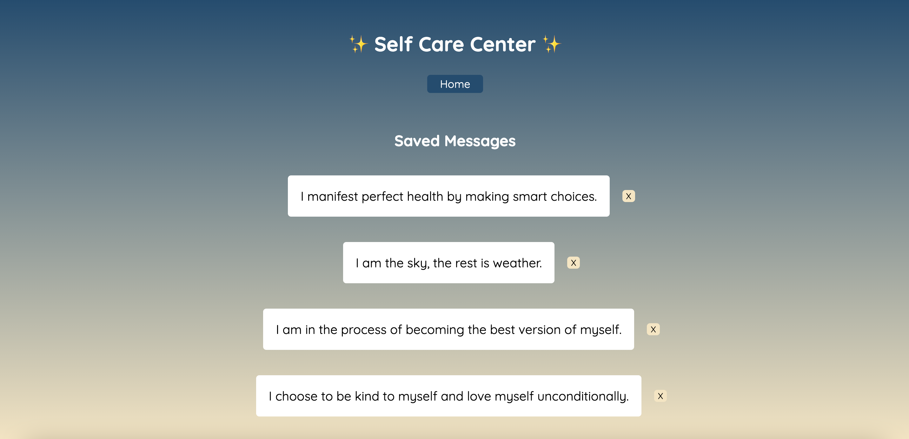

# Self-Care Center 

### Abstract:
[//]: <> (Briefly describe what you built and its features. What problem is the app solving? How does this application solve that problem?)

The Self Care Center application allows a user to recieve a positive message and save it to a separate page. After selecting either 'affirmation' or 'mantra,' the user will receive the type of message they have chosen and may 'favorite' the message if they choose. They can access their favorited messages on the 'view saved messages' page, and delete their messages if they choose.

### Installation Instructions:
[//]: <> (What steps does a person have to take to get your app cloned down and running?)
To run self care center, you may fork this repo, clone in th your local computer, and open the index.html file from your terminal.

### Preview of App:
[//]: <> (Provide ONE gif or screenshot of your application - choose the "coolest" piece of functionality to show off.)

### Context:
[//]: <> (Give some context for the project here. How long did you have to work on it? How far into the Turing program are you?)

I began this project during week 3 of mod 1 at the Turing school of Software and Design. I spent around 15 hours completing the project between December 13th 2022 and December 18th 2022.

### Contributors:
[//]: <> (Who worked on this application? Link to their GitHubs.)

Katherine Blaine - [github profile](https://github.com/KatherineBlaine)

### Learning Goals:
[//]: <> (What were the learning goals of this project? What tech did you work with?)

The learning goals of this project were to:
- Gain experience building an application that utilizes HTML, CSS, and Javascript
- Write HTML and CSS to match a provided comp
- Understand how to listen to and respond to user events
- Individualize your programming skill set

### Wins + Challenges:
[//]: <> (What are 2-3 wins you have from this project? What were some challenges you faced - and how did you get over them?)

#### Wins:
- It felt really good to come into this project with a higher level of comfort with the Javascript programming expected of me. It most definitely was not easy, but it was exciting to look over the project expectations and actually feel like I had a good direction of where to star.
- For my first time writing HTML and CSS files, I am really proud of how it all turned out. I was patient as I messed around with it until it looked how I wanted to, and then took the time to really understand what each HTML element or CSS declaration was doing.

### Challenges:
- Although I felt really proud of my resilience working through my first HTML and CSS files, it did not go without struggle and frustration.
- Additionally, I had wanted to add additional features, but despite my JS confidence coming into the project, it definitely took me a while to get things functioning properly. I hope to continue developing this project in the future!